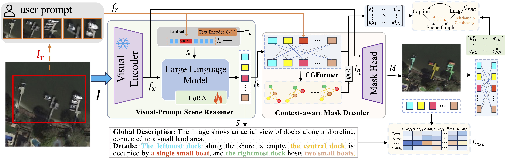
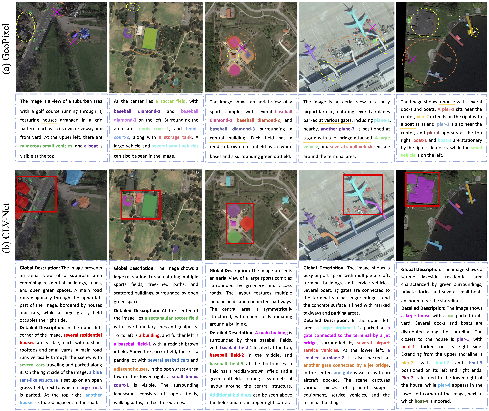
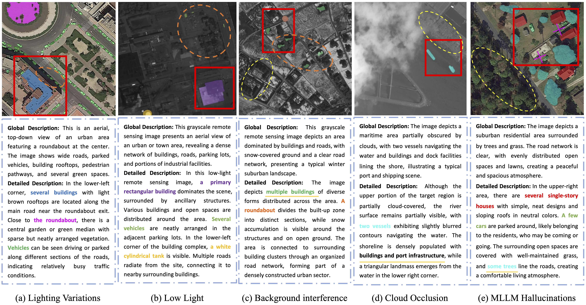

### <p align="center">Cross-modal Context-aware Learning for Visual Prompt Guided Multimodal Image Understanding in Remote Sensing
<br>
<div align="center">
  <a href="https://www.researchgate.net/profile/Zhang-Xu-48/research" target="_blank">Xu&nbsp;Zhang</a> <b>&middot;</b>
  Jiabin&nbsp;Fang</a> <b>&middot;</b>
  Zhuoming&nbsp;Ding</a> <b>&middot;</b>
  Jin&nbsp;Yuan</a> <b>&middot;</b>
  Xuan&nbsp;Liu</a> <b>&middot;</b>
  Qianjun&nbsp;Zhang</a> <b>&middot;</b>
  Zhiyong&nbsp;Li</a>
  <br> <br>

  <a href="https://arxiv.org/pdf/2512.11680" target="_blank">Paper</a>

####

[comment]: <> (  <a href="https://arxiv.org/" target="_blank">Demo Video &#40;Youtube&#41;</a> &emsp;)

[comment]: <> (  <a href="https://arxiv.org/" target="_blank">演示视频 &#40;B站&#41;</a> &emsp;)
</div>
<br>
<p align="center">:hammer_and_wrench: :construction_worker: :rocket:</p>
<p align="center">:fire: We will release code and checkpoints in the future. :fire:</p>
<br>


### Update
- 2026.01.27 Init repository.

### TODO List
- [ ] Code release. 

### Abstract
Recent advances in image understanding have enabled methods that leverage large language models for multimodal reasoning in remote sensing. However, existing approaches still struggle to steer models to the user-relevant regions when only simple, generic text prompts are available. Moreover, in large-scale aerial imagery many objects exhibit highly similar visual appearances and carry rich inter-object relationships, which further complicates accurate recognition.To address these challenges, we propose Cross-modal Context-aware Learning for Visual Prompt–Guided Multimodal Image Understanding (CLV-Net). CLV-Net lets users supply a simple visual cue—a bounding box—to indicate a region of interest, and uses that cue to guide the model to generate correlated segmentation masks and captions that faithfully reflect user intent. Central to our design is a Context-Aware Mask Decoder that models and integrates inter-object relationships to strengthen target representations and improve mask quality. In addition, we introduce a Semantic and Relationship Alignment module: a Cross-modal Semantic Consistency Loss enhances fine-grained discrimination among visually similar targets, while a Relationship Consistency Loss aligns textual relations with visual interactions, identifying meaningful commonalities to guide model output. Comprehensive experiments on two benchmark datasets show that CLV-Net outperforms existing methods and establishes new state-of-the-art results. The model effectively captures user intent and produces precise, intention-aligned multimodal outputs.

 

## CLV-Net




## Results

<div align=center>

</div>

<div align=center>

</div>


### Contact
Feel free to contact me if you have additional questions or have interests in collaboration. Please drop me an email at xuzhang1211@hnu.edu.cn. =)


## Citation

```
@article{zhang2025cross,
  title={Cross-modal Context-aware Learning for Visual Prompt Guided Multimodal Image Understanding in Remote Sensing},
  author={Zhang, Xu and Fang, Jiabin and Ding, Zhuoming and Yuan, Jin and Liu, Xuan and Zhang, Qianjun and Li, Zhiyong},
  journal={arXiv preprint arXiv:2512.11680},
  year={2025}
}
```
